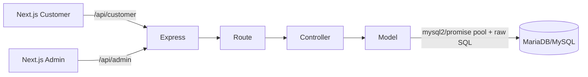

# Arsitektur Backend CleanGo

Runtime mengikuti alur `Route → Controller → Model → MySQL`.

- Route hanya URL, HTTP method, middleware, dan controller.
- Controller membaca request, memvalidasi, menentukan status, dan memanggil model.
- Model adalah satu-satunya tempat SQL; nilai query selalu placeholder `?`.
- JWT membawa identity dan role; admin middleware memverifikasi role token.
- Password disimpan sebagai hash bcrypt.
- CORS → JSON → logger → router → 404 → error handler adalah urutan middleware.
- Operasi multi-query booking/order fase berikutnya wajib transaction.

Struktur Supabase/PostgreSQL lama sudah dihapus setelah dipastikan tidak lagi
direferensikan oleh runtime, build, maupun test MySQL.
