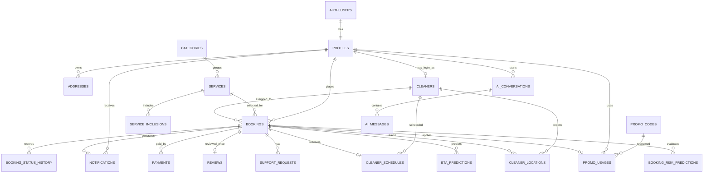

# CleanGo Database

## ERD

## Tabel dan cardinality

| Tabel | Fungsi utama |
|---|---|
| `profiles` | Ekstensi 1:1 `auth.users`; role customer/admin |
| `addresses` | Banyak alamat per customer |
| `categories`, `services`, `service_inclusions` | Catalog normalized |
| `cleaners` | Cleaner operasional; `user_id` nullable untuk cleaner app masa depan |
| `bookings` | Aggregate order, harga snapshot, schedule, current status |
| `booking_status_history` | Append-only audit setiap status |
| `cleaner_schedules` | Satu reservasi per booking dan proteksi overlap per cleaner |
| `cleaner_locations` | Sampel lokasi yang terikat cleaner dan booking |
| `payments` | Struktur payment manual/gateway-ready |
| `promo_codes`, `promo_usages` | Definisi dan redemption promo |
| `reviews` | Maksimal satu review per completed booking |
| `notifications` | Inbox user |
| `support_requests` | Tiket bantuan per booking |
| `eta_predictions` | Riwayat prediksi ETA |
| `booking_risk_predictions` | Riwayat risk delay/no-show |
| `ai_conversations`, `ai_messages` | Percakapan chatbot milik user |
| `private.booking_code_counters` | Counter internal per tanggal untuk booking code |

Semua foreign key operasional memiliki index pada kolom ownership/join utama.
Unique dan check constraint menjaga booking code, rating, koordinat, nominal,
rentang waktu, promo, dan konsistensi total.

## Enum dan lifecycle

- `app_role`: `customer`, `admin`
- `cleaner_status`: `available`, `busy`, `offline`
- `booking_status`: `pending → confirmed → cleaner_assigned → departed → on_the_way → arrived → cleaning → completed`
- Jalur alternatif: `delayed`, `no_show`, `cancelled`
- `payment_status`: `pending`, `paid`, `failed`, `refunded`
- `schedule_status`: `scheduled`, `completed`, `cancelled`

Fase 1–9 membuat history pada creation dan assignment. Enforcement seluruh
transition dan notifikasi setiap perubahan akan diselesaikan pada Fase 10.

## Schedule conflict

`cleaner_schedules.schedule_period` adalah generated `tstzrange(start_at,
end_at, '[)')`. Exclusion constraint GiST menolak dua schedule berstatus
`scheduled` untuk cleaner yang sama jika range bertumpuk. Batas `[)` membuat
slot 09:00–11:00 dan 11:00–13:00 tetap valid. Timestamp absolut juga mendukung
pekerjaan yang melewati tengah malam.

## RLS strategy

- Semua tabel `public` mengaktifkan RLS.
- Customer hanya melihat row miliknya melalui `auth.uid()`.
- Role tidak dapat diubah lewat grant profile customer.
- Admin diverifikasi oleh helper privat `private.is_admin()`.
- Mutasi aggregate booking tidak tersedia langsung; RPC privileged melakukan
  authorization lalu menulis seluruh side effect dalam satu transaksi.
- Lokasi cleaner hanya terlihat oleh pemilik booking aktif.
- Risk prediction hanya dapat dibaca admin.

## Realtime design

Target publication Fase 11: `bookings`, `booking_status_history`,
`notifications`, dan `cleaner_locations`. RLS tetap menjadi filter data pada
subscription customer. Publication belum diaktifkan pada Fase 1–9 agar status
implementasi tidak disalahartikan sebagai selesai.
