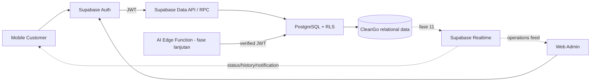

# Arsitektur Backend CleanGo

## Batas sistem

Backend adalah satu-satunya sumber kebenaran untuk identity, authorization,
harga, status booking, penugasan cleaner, dan jadwal. Mobile customer dan web
admin menggunakan Supabase SDK/Data API dengan access token dari Supabase Auth.

## Komponen

1. **Supabase Auth** menangani register, login, logout, dan reset password.
2. **PostgreSQL** menyimpan seluruh data bisnis secara relasional.
3. **Data API + RLS** menjadi jalur akses frontend dengan least privilege.
4. **Database RPC** menangani operasi multi-tabel/transaksional; booking dan
   assignment sudah tersedia pada Fase 8–9.
5. **Realtime** akan dipublikasikan untuk booking, history, notifikasi, dan
   lokasi cleaner pada Fase 11.
6. **Edge Function AI** akan memverifikasi JWT dan tidak menerima `user_id`
   sebagai sumber identity.

## Batas fase 1-9

Schema domain lengkap, RLS, `create_booking`, dan `assign_cleaner` sudah aktif.
Operasi status, review, payment, support, location, ETA/risk, reporting,
Realtime, dan AI masih tertutup sampai RPC fase masing-masing tersedia.

## Daftar RPC/function

| Function | Fase | Tujuan |
|---|---:|---|
| `private.is_admin()` | 6 | Helper policy; memeriksa role database |
| `private.handle_new_user()` | 5 | Membuat profile customer dari auth user |
| `private.set_updated_at()` | 5 | Menjaga timestamp modifikasi |
| `create_booking(...)` | 8 — selesai | Validasi owner/address/service, promo, dan harga |
| `assign_cleaner(...)` | 9 — selesai | Assignment dan schedule tanpa race condition |
| `update_booking_status(...)` | 7-10 | Transition, history, dan notification atomik |
| `create_review(...)` | 7-8 | Validasi booking completed dan owner |
| `mark_notification_as_read(...)` | 7 | Update notifikasi milik caller |
| `get_customer_active_booking()` | 7 | Booking aktif milik caller |
| `get_admin_dashboard_summary()` | 11 | KPI dashboard admin |
| reporting RPC/views | 11 | Agregasi harian/bulanan dan performa service |

