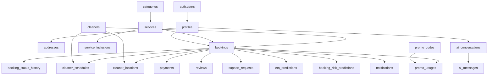

# ERD CleanGo

ERD lengkap dan penjelasan cardinality berada di
[DATABASE.md](DATABASE.md#erd). File tunggal tersebut menjadi sumber kebenaran
agar diagram tidak berbeda dengan migration aktif.

Relasi inti:

